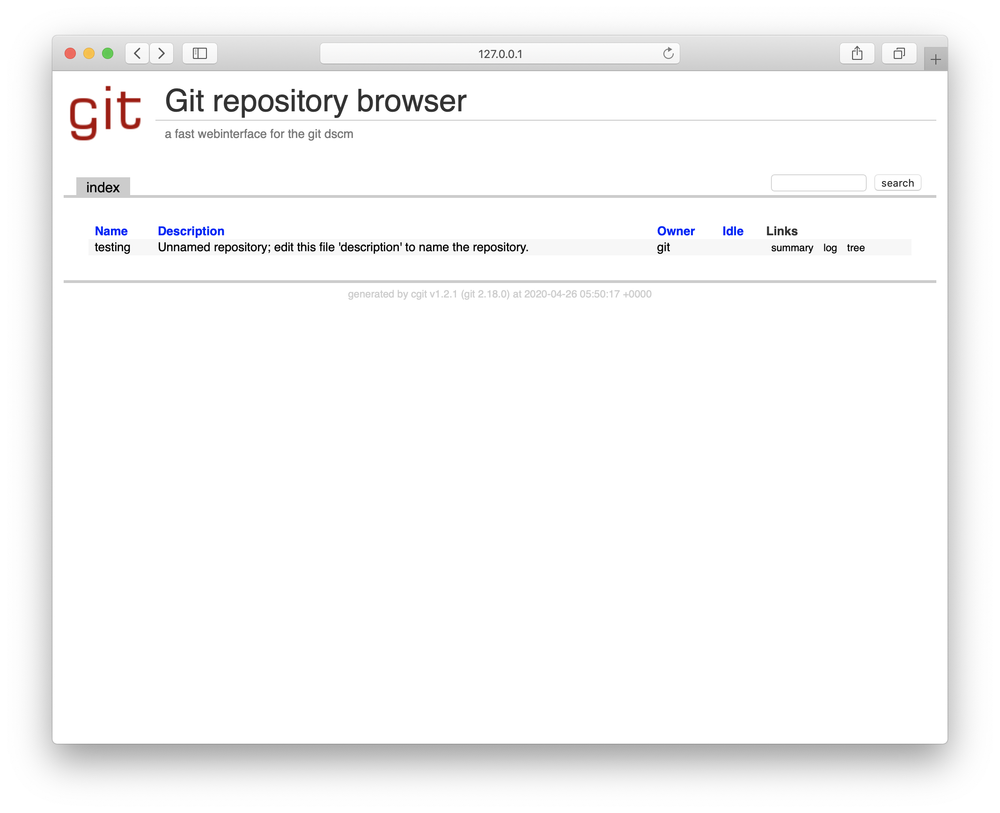

# gitolite-cgit based on alpine image

## What is this image?

[`bacnh85/gitolite-cgit`](https://hub.docker.com/r/bacnh85/gitolite-cgit) is a Docker image with `cgit` and `gitolite` running on top of `alpine` base image. Dockerfile is available at [Github repo](https://github.com/bacnh85/docker-gitolite-cgit).



## Usage

1. Pull the image

```
docker pull bacnh85/gitolite-cgit
```

2. Run the image with provided environment:

```
docker run -e SSH_KEY="$(cat ~/.ssh/id_rsa.pub)" -e SSH_KEY_NAME="$(whoami)" -p 22:22 -p 80:80 -p 9418:9418 -v repo:/var/lib/git/ bacnh85/gitolite-cgit
```

### Environment

- `SSH_KEY`: Public key of gitolite admin
- `SSH_KEY_NAME`: Name of gitolite admin
- `CGIT_CLONE_PREFIX`: cgit clone prefix to display on each repository. For example: my web url is: `https://git.bacnh.com`, the clone URL should be: `ssh://git@git.bacnh.com`
- `CGIT_ROOT_TITLE`: Text printed as heading on the repository index page. Default value: "Git Repository Browser".
### Exposed ports

- Port 22: for SSH clone
- Port 80: for cgit webpage running on Nginx
- Port 9418: for git daemon protocol

### Volume

- `/var/lib/git`: gitolite home folder, store all repositories, `gitolite-admin` repo, ...
- `/etc/ssh/`: store all generated SSH server key

### How to interact with git server

Cgit webpage: `http://<server_ip>/`

Supported clone method:
- SSH: authentication with gitolite configuration inside `gitolite-admin`. For more information, pls refer to (basic administration](https://gitolite.com/gitolite/basic-admin.html). Syntax: `git clone ssh://git@<server_ip>/<repo_name>`
- HTTP: `enable-http-clone=1` by default, which let cgit act as a dumb HTTP enpoint for git clones. You can disable that by edit /etc/cgitrc. I may consider to add more feature, so you can set config from `docker run` or `docker-compose.yml`. `git push` is not supported via HTTP at this moment. Syntax: `git clone http://<server_ip>/<repo_name>`
- GIT: `git daemon` is enabled by default with `upload-pack` service (this serves git fetch-pack and git ls-remote clients), allowing anonymous fetch, clone. Syntax: `git clone git://<server_ip>/<repo_path>`

## Docker-compose

1. Pull the image:

```
docker pull bacnh85/gitolite-cgit
```

2. Create environment file

In this repo, I create `gitolite` admin with the host public key and username. In case, you are running this on server, you need to enter SSH_KEY and SSH_KEY_NAME into `config.env`:

```
#
# Gitolite options
#
SSH_KEY=<your public key content>
SSH_KEY_NAME=<your gitolite name>
#
# Cgit options
#
CGIT_CLONE_PREFIX=<cgit clone prefix like: ssh://git@foo.org git://foo.org >
CGIT_ROOT_TITLE=Git Repository Browser
```

For convience, I create a script for user who use the public key and name from the host running Docker:

```
# change ssh_key, ssh_key_name to reflect your current setup
SSH_KEY=$(cat ~/.ssh/id_rsa.pub)
SSH_KEY_NAME=$(whoami)

sed -i.bak \
    -e "s#SSH_KEY=.*#SSH_KEY=${SSH_KEY}#g" \
    -e "s#SSH_KEY_NAME=.*#SSH_KEY_NAME=${SSH_KEY_NAME}#g" \
    "$(dirname "$0")/config.env"
```

3. Create `docker-compose.yml`:

```
version: '3'

services:
  app:
    image: bacnh85/gitolite-cgit
    container_name: gitolite-cgit
    env_file: config.env
    volumes: 
      - git:/var/lib/git/
    ports:
      - 22:22
      - 80:80
      - 9418:9418
    tty: true
volumes: 
  git:
```
Then power-on your container:
```
docker-compose up -d
```

### Customize cgit configuration

As there are many cgit configuration, you can create cgitrc configure and map to `/etc/cgitrc`

```
# Copy cgitrc from existing container
docker cp gitolite-cgit:/etc/cgitrc .
```

Modify the `docker-compose.yml`:

```
version: '3'

services:
  app:
    image: bacnh85/gitolite-cgit
    container_name: gitolite-cgit
    env_file: config.env
    volumes: 
      - git:/var/lib/git/
      - ./cgitrc:/etc/cgitrc
    ports:
      - 22:22
      - 80:80
      - 9418:9418
    tty: true
volumes: 
  git:
```

## Build docker image

```
git clone https://github.com/bacnh85/docker-gitolite-cgit.git
cd docker-gitolite-cgit
docker build gitolite-cgit -t bacnh85/gitolite-cgit
```

